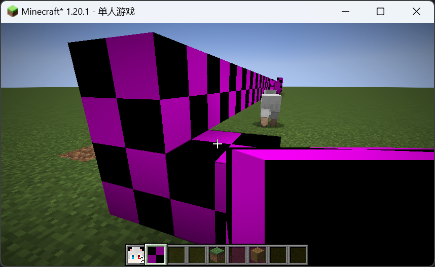
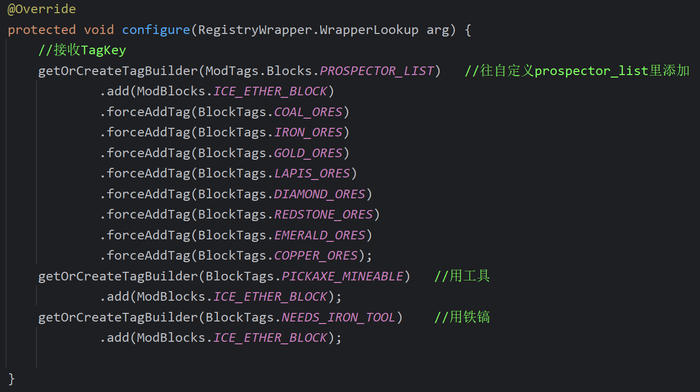

# 操作
在终端输入./gradlew genSources会获取mc反编译的文件，由此可以看到源码

# gradle.properties放着配置信息
mod_version=1.0.0
maven_group=com.byzh
archives_base_name=try-mod

# src/main/resources/fabric.mod.json放着更详细的配置信息
license协议
icon模组图片

# 启动
gradle-Tasks-fabric-runClient

# 数据生成
gradle-Tasks-fabric-runDatagen

# 创建


# lang
> 若不写lang，大致以“类型.模组ID.物品名字”显示
> 类型由mc内部决定
> 模组ID由模组ID决定
> 物品名字由new Identifier内的name决定

src/main/resources/assets/try-mod/lang/en_us.json
src/main/resources/assets/try-mod/lang/zh_cn.json


# Item
1. 代码
```java
public class ModItems {
    //注册物品
    public static final Item ICE_ETHER = registerItems("ice_ether",new Item(new FabricItemSettings()));

    //物品注册的方法
    private static Item registerItems(String name,Item item){
        return Registry.register(
                Registries.ITEM,
                new Identifier(TryMod.MOD_ID, name),
                item);
    }
}
```
2. 语言文件
src/main/resources/assets/try-mod/lang/en_us.json
src/main/resources/assets/try-mod/lang/zh_cn.json
3. 模型|物品状态文件
用Minecraft原版物品的渲染方法
MC会**自动**根据物品注册时new Identifier内的name来找models下对应的xxx.json
会根据ice_ether.json来定位材质文件所在位置
src/main/resources/assets/try-mod/models/item/ice_ether.json
4. 材质文件
src/main/resources/assets/try-mod/textures/item/ice_ether.png

# ItemGroup
写在一行
```java
public static final ItemGroup Try_Group = Registry.register(
            Registries.ITEM_GROUP,
            new Identifier(TryMod.MOD_ID, "try_group"),
            FabricItemGroup.builder()
                    .displayName(Text.translatable("itemGroup.try_group"))
                    .icon(()->new ItemStack(ModItems.ICE_ETHER))
                    .entries( (displayContext, entries) -> {
                        entries.add(ModItems.ICE_ETHER);
                        entries.add(ModBlocks.ICE_ETHER_BLOCK);
                        entries.add(Items.BOOK);
                        entries.add(Blocks.GRASS_BLOCK);
                    }).build()
    );
```
分多行写
```java
public static final ItemGroup TRY_GROUP_Bulider = FabricItemGroup.builder()
            .displayName(Text.translatable("itemGroup.try_group"))
            .icon(()->new ItemStack(ModItems.ICE_ETHER))
            .entries( (displayContext, entries) -> {
                entries.add(ModItems.ICE_ETHER);
                entries.add(ModBlocks.ICE_ETHER_BLOCK);
                entries.add(Items.BOOK);
                entries.add(Blocks.GRASS_BLOCK);
            }).build();
public static final ItemGroup TRY_GROUP = registerItemGroups("try_group", TRY_GROUP_Bulider);
//物品栏注册的方法
private static ItemGroup registerItemGroups(String name, ItemGroup itemGroup){
        return Registry.register(
                Registries.ITEM_GROUP,
                new Identifier(TryMod.MOD_ID, name),
                itemGroup);
    }
```
# Block
Block注册分为 方块(Block) and 方块物品(BlockItem)

方块掉落物文件：
src/main/resources/data/try-mod/loot_tables/blocks/ice_ether_block.json

方块状态文件：
src/main/resources/assets/try-mod/blockstates/ice_ether_block.json
告诉mc当渲染名为ice_ether_block的方块时，应该使用哪个模型文件 

方块模型文件：
src/main/resources/assets/try-mod/models/block/ice_ether_block.json
"all": 6个面都是
"cube_all": 内置的模型，一个简单的立方体

方块材质文件:
src/main/resources/assets/try-mod/textures/block/ice_ether_block.png
> 如果没有，就会变成
> 

方块手持文件:
src/main/resources/assets/try-mod/models/item/ice_ether_block.json
> 继承自方块材质文件
> 如果没有，就会变成
> 

> 对copyOf中的Blocks.STONE的STONE进行ctrl+b
> 

# 配方
src/main/resources/data/try-mod/recipes/ice_ether_to_block.json
如果要复写原版物品的配方，则加上 "replace": true,
> 外部库可以找到mc原版物品的json写法
> 

# loot_tables
src/main/resources/data/try-mod/loot_tables/blocks/ice_ether_block.json
rolls: 指定在抽奖池中抽奖的基础次数
bonus_rolls：配合幸运值属性增加战利品投掷的次数，值可为浮点数，可以为负数，等同于在rolls的次数基础上增加额外的抽取次数。
计算公式如下：
最终投掷次数 = rolls + luck * bonus_rolls（结果向下取整，若最终投掷次数≤0则不掉落）

还需要注册到 挖掘等级 中:
注意，必须需要写"replace": false


# ModFoodComponents
src/main/java/com/byzh/item/ModFoodComponents.java
> 同时在Item注册时加上链式编程:
> public static final Item BYZH_FOOD = registerItems("byzh_food",new Item(new FabricItemSettings().food(ModFoodComponents.CORN)));

# Fuel
注册好Item后，将其写在初始化中即可
```java
@Override
public void onInitialize() {
    LOGGER.info("Hello Fabric world!");
    //物品注册
    ModItems.registerModItems();
    //物品栏注册
    ModItemGroup.registerModItemGroup();
    //方块注册
    ModBlocks.registerModBlocks();
    //燃料注册
    FuelRegistry.INSTANCE.add(ModItems.BYZH_COAL, 2000);
	}
```

# 工具信息
在Item类中重写方法
```java
@Override 
public void appendTooltip(ItemStack stack, @Nullable World world, List<Text> tooltip, TooltipContext context) {
    super.appendTooltip(stack, world, tooltip, context);
}
```

# Tag
java中：
src/main/java/com/byzh/util/ModTags.java
data中：
src/main/resources/data/try-mod/tags/blocks/prospector_list.json

# DataGen
src/main/java/com/byzh/TryModDataGenerator.java


extends FabricModelProvider


extends FabricBlockLootTableProvider


extends FabricTagProvider.BlockTagProvider


# 更多Block
楼梯：
new StairBlock(ModBlocks.ICE_ETHER_BLOCK.getDefaultState(), FabricBlockSettings.copyOf(Blocks.STONE))
台阶：
new SlabBlock(FabricBlockSettings.copyOf(Blocks.STONE))
按钮：
new ButtonBlock(FabricBlockSettings.copyOf(Blocks.STONE), BlockSetType.STONE, 20, true)
压力板：
new PressurePlateBlock(PressurePlateBlock.ActivationRUle.EVERYTHING, FabricBlockSettings.copyOf(Blocks.STONE), BlockSetType.STONE)
栅栏：(需要注册到json)
new FenceBlock(FabricBlockSettings.copyOf(Blocks.STONE))
栅栏门：(需要注册到json)
new FenceGateBlock(FabricBlockSettings.copyOf(Blocks.STONE), WoodType.OAK)
石砖：(需要注册到json)
new WallBlock(FabricBlockSettings.copyOf(Blocks.STONE))
门：(.nonOpaque()使得材质可透明)
new DoorBlock(FabricBlockSettings.copyOf(Blocks.STONE).nonOpaque(), BlockSetType.STONE)
活板门：(.nonOpaque()使得材质可透明)
new TrapdoorBlock(FabricBlockSettings.copyOf(Blocks.STONE).nonOpaque(), BlockSetType.STONE)

添加Tag时：

添加LootTable时：
addDrop(ModBlocks.ICE_ETHER_DOOR, doorDrops(ModBlocks.ICE_ETHER_DOOR));
addDrop(ModBlocks.ICE_ETHER_SLAB, slabDrops(ModBlocks.ICE_ETHER_SLAB));
添加BlockState时：

添加材质时：
注意门有两个材质

用透明材质时：
除了要.nonOpaque()
还要在Client类中写以下内容


# 拓展：探矿器
src/main/java/com/byzh/item/custom/Prospector.java
因为Prospector已经继承了Item
所以注册物品的时候new的是Prospector而不是Item