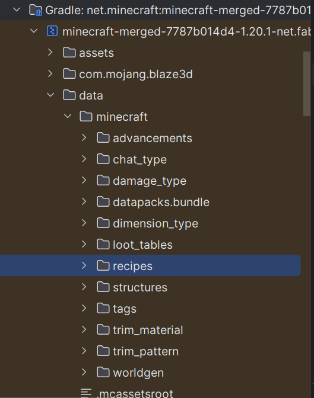

# gradle.properties放着配置信息
mod_version=1.0.0
maven_group=com.byzh
archives_base_name=try-mod

# src/main/resources/fabric.mod.json放着更详细的配置信息
license协议
icon模组图片

# 启动
gradle-Tasks-fabric-runClient

# lang
> 若不写lang，大致以“类型.模组ID.物品名字”显示
> 类型由mc内部决定
> 模组ID由模组ID决定
> 物品名字由new Identifier内的name决定

src/main/resources/assets/try-mod/lang/en_us.json
src/main/resources/assets/try-mod/lang/zh_cn.json


# Item
1. 代码
```java
public class ModItems {
    //注册物品
    public static final Item ICE_ETHER = registerItems("ice_ether",new Item(new FabricItemSettings()));

    //物品注册的方法
    private static Item registerItems(String name,Item item){
        return Registry.register(
                Registries.ITEM,
                new Identifier(TryMod.MOD_ID, name),
                item);
    }
}
```
2. 语言文件
src/main/resources/assets/try-mod/lang/en_us.json
src/main/resources/assets/try-mod/lang/zh_cn.json
3. 模型|物品状态文件
用Minecraft原版物品的渲染方法
MC会**自动**根据物品注册时new Identifier内的name来找models下对应的xxx.json
会根据ice_ether.json来定位材质文件所在位置
src/main/resources/assets/try-mod/models/item/ice_ether.json
4. 材质文件
src/main/resources/assets/try-mod/textures/item/ice_ether.png
# ItemGroup
写在一行
```java
public static final ItemGroup Try_Group = Registry.register(
            Registries.ITEM_GROUP,
            new Identifier(TryMod.MOD_ID, "try_group"),
            FabricItemGroup.builder()
                    .displayName(Text.translatable("itemGroup.try_group"))
                    .icon(()->new ItemStack(ModItems.ICE_ETHER))
                    .entries( (displayContext, entries) -> {
                        entries.add(ModItems.ICE_ETHER);
                        entries.add(ModBlocks.ICE_ETHER_BLOCK);
                        entries.add(Items.BOOK);
                        entries.add(Blocks.GRASS_BLOCK);
                    }).build()
    );
```
分多行写
```java
public static final ItemGroup TRY_GROUP_Bulider = FabricItemGroup.builder()
            .displayName(Text.translatable("itemGroup.try_group"))
            .icon(()->new ItemStack(ModItems.ICE_ETHER))
            .entries( (displayContext, entries) -> {
                entries.add(ModItems.ICE_ETHER);
                entries.add(ModBlocks.ICE_ETHER_BLOCK);
                entries.add(Items.BOOK);
                entries.add(Blocks.GRASS_BLOCK);
            }).build();
public static final ItemGroup TRY_GROUP = registerItemGroups("try_group", TRY_GROUP_Bulider);
//物品栏注册的方法
private static ItemGroup registerItemGroups(String name, ItemGroup itemGroup){
        return Registry.register(
                Registries.ITEM_GROUP,
                new Identifier(TryMod.MOD_ID, name),
                itemGroup);
    }
```
# Block
Block注册分为 方块(Block) and 方块物品(BlockItem)

方块状态文件：
src/main/resources/assets/try-mod/blockstates/ice_ether_block.json
告诉mc当渲染名为ice_ether_block的方块时，应该使用哪个模型文件 

方块模型文件：
src/main/resources/assets/try-mod/models/block/ice_ether_block.json
"all": 6个面都是
"cube_all": 内置的模型，一个简单的立方体

方块材质文件:
src/main/resources/assets/try-mod/textures/block/ice_ether_block.png
> 如果没有，就会变成
> 

方块手持文件:
src/main/resources/assets/try-mod/models/item/ice_ether_block.json
> 继承自方块材质文件
> 如果没有，就会变成
> 

> 对copyOf中的Blocks.STONE的STONE进行ctrl+b
> 
# 配方
src/main/resources/data/try-mod/recipes/ice_ether_to_block.json
如果要复写原版物品的配方，则加上 "replace": true,
> 外部库可以找到mc原版物品的json写法
> 

# loot_tables
src/main/resources/data/try-mod/loot_tables/blocks/ice_ether_block.json
rolls: 指定在抽奖池中抽奖的基础次数
bonus_rolls：配合幸运值属性增加战利品投掷的次数，值可为浮点数，可以为负数，等同于在rolls的次数基础上增加额外的抽取次数。
计算公式如下：
最终投掷次数 = rolls + luck * bonus_rolls（结果向下取整，若最终投掷次数≤0则不掉落）

还需要注册到 挖掘等级 中:
注意，必须需要写"replace": false


# 拓展：探矿器
src/main/java/com/byzh/item/custom/Prospector.java